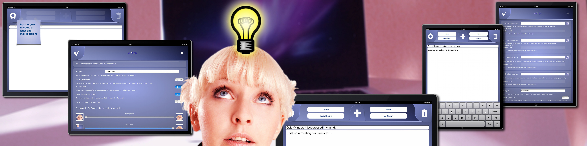

# Welcome to QuickMinder

QuickMinder is - or better was - an application for iPhone and iPad to send small messages to predefined email recipients.

A thought, an idea, something you need to do crossed your mind: capture it quick, easy and fast with QuickMinder. Predefine up to four recipients for your thoughts and send them via email. It takes just two steps: Type your text in QuickMinder, push the button with your predefined recipient and the email will be sent. Set up once and you are good to go.

Features:

- universal app, runs on iPhone, iPod touch and iPad
- iPad: up to four recipients for your emails
- iPhone/iPod touch: up to two recipients for your emails
- look recipients in your address book
- uses the first line of text as a subject
- use a predefined subject
- turn off word correction if you like
- delete text automatically after you have sent your message if you like
- show keyboard directly after start, be quicker with writing
- runs in portrait and landscape mode
- sends mail using your mail account, mails come from you, no extra service needed
- insert current GPS coordinates if you like
- supports Retina Display
- supports creating and attaching photos
- supports TextExpander Touch

# Compiling

The code in this repository will not compile since it was created somewhere around the year 2011 and 2012. If you really want to try, you need at least

- a computer with MacOS,
- xCode installed and an
- Apple Developer license.

# Why did I stop?

There is more than one reason:

- Apple decided to make it impossible to use the email API without using an extra form that must be submitted by the user.
  - On one hand it is understandable to prevent apps to send emails without the user knowing about it. But that could have been caught by a dialogue asking if it was OK to send mails.
  - On the other hand it would have been valid to ship a complete implementation of an MTA - but that would mean that a user must enter all the details of alle the used mail providers and all account data with all the hassle that comes as byproduct.
- The only way to be visible in the app store was releasing updates. This caused the app to be visble on the front page for a short peroid of time. Even searching for words in the description of the app did not show it!

  That is way too much work for a one man show hobby project!
- Creating apps for iPad and iPhone costs money. Even when you do it just for yourself. That combined with too much work let me shut down the project.

But not everthing was bad or useless. I learned so much on the way about GUI and parallel programming that was useful for my day to day job.

# License

Unless otherwise stated the code is licensed under the [MIT License](./MIT-License). Code from other parties is licensed under their respective licenses as written in the code.
